Thank you for considering contributing to the **OWASP Nest** project! This guide provides everything you need to know to contribute to the Nest platform itself.

## About the Project

Nest is a full-stack web application built using:

- **Backend**: Python, Django
- **Frontend**: TypeScript, Next.js, React, Tailwind CSS
- **Search**: Algolia

The project uses a **containerized approach** for both development and production environments. Docker is required to run Nest locally.

## Prerequisites

Before contributing, ensure you have the following installed:

1. **Docker**: Required for running the Nest instance - [Docker documentation](https://docs.docker.com/)
2. **pre-commit**: Required to automate code checks - [pre-commit documentation](https://pre-commit.com/)
3. **WSL (Windows Subsystem for Linux)**: Required for Windows users to enable Linux compatibility - [WSL documentation](https://docs.microsoft.com/en-us/windows/wsl/)

<Warning>
**Windows Users**: You must use WSL terminal (not Windows PowerShell). The `make run` command requires WSL to function properly. If you haven't installed WSL yet, follow [Microsoft's official guide](https://learn.microsoft.com/en-us/windows/wsl/install).

- Ensure WSL integration is enabled in Docker Desktop settings by checking `Resources -- WSL integration`
- Cloning or running the project under `/mnt/c` (the Windows C: drive) can lead to significant performance degradation and Docker permission issues
</Warning>

## Starring and Forking

Before you begin:

1. Star the project: [OWASP/Nest](https://github.com/OWASP/Nest)
2. Fork the repository: [Fork OWASP/Nest](https://github.com/OWASP/Nest/fork)

## Environment Setup

<Steps>
  <Step title="Clone the Repository">
    Clone the repository from your GitHub account:
    
    ```bash
    git clone https://github.com/<your-account>/<nest-fork>
    ```
  </Step>

  <Step title="Create Environment Files">
    Copy the template files to create your local environment configuration:
    
    ```bash
    cp backend/.env.example backend/.env
    cp frontend/.env.example frontend/.env
    ```
    
    <Warning>
    Ensure that all `.env` files are saved in **UTF-8 format without BOM (Byte Order Mark)**. This is crucial to prevent "Unexpected character" errors during application execution or Docker image building.
    
    **You need to restart the application to apply any `.env` file changes.**
    </Warning>
  </Step>

  <Step title="Configure Django Settings">
    Open `backend/.env` and set the Django configuration to `Local`:
    
    ```plaintext
    DJANGO_CONFIGURATION=Local
    ```
  </Step>

  <Step title="Set Up Algolia">
    1. Go to [Algolia](https://www.algolia.com/) and create a free account
    2. An Algolia app is automatically created for you when you sign up
    3. During sign up, you can skip the data import step
    4. Update your `backend/.env` file with your Algolia credentials:
    
    ```plaintext
    DJANGO_ALGOLIA_APPLICATION_ID=<your-algolia-application-id>
    DJANGO_ALGOLIA_WRITE_API_KEY=<your-algolia-write-api-key>
    ```
    
    <Note>
    The default write API key should have index write permissions (addObject permission). If you use a different API key, ensure it has this permission.
    </Note>
  </Step>

  <Step title="Run the Application">
    Navigate to the project root directory (not `backend` or `frontend` subdirectories) and run:
    
    ```bash
    make run
    ```
    
    Leave this terminal session running and wait until [Nest local](http://localhost:8000/api/v0) is responding.
    
    <Note>
    As we use a containerized approach, this command must run in parallel to other Nest commands. Keep it running in the current terminal and use another terminal session for your work.
    </Note>
  </Step>

  <Step title="Load Initial Data">
    Make sure you have `gzip` installed, then open a new terminal session and run:
    
    ```bash
    make load-data
    ```
  </Step>

  <Step title="Index Data">
    In the same terminal session, run:
    
    ```bash
    make index-data
    ```
  </Step>

  <Step title="Verify API Endpoints">
    Check that the following endpoints are available:
    - [API](http://localhost:8000/api/v0/)
    - [GraphQL](http://localhost:8000/graphql/)
  </Step>
</Steps>

## Environment Variables Reference

For a complete list of environment variables, see the sections below:

### Frontend Variables

- `NEXT_PUBLIC_API_URL` - The base URL for the application's internal API
- `NEXT_PUBLIC_CSRF_URL` - Endpoint for fetching CSRF tokens
- `NEXT_PUBLIC_ENVIRONMENT` - Current environment (`development`, `production`)
- `NEXT_PUBLIC_GRAPHQL_URL` - GraphQL API endpoint
- `NEXT_PUBLIC_GTM_ID` - Google Tag Manager container ID
- `NEXT_PUBLIC_RELEASE_VERSION` - Current release version
- `NEXT_PUBLIC_SENTRY_DSN` - Sentry error tracking DSN

### Backend Variables

- `DJANGO_ALGOLIA_APPLICATION_ID` - Algolia application ID
- `DJANGO_ALGOLIA_WRITE_API_KEY` - Algolia write API key
- `DJANGO_ALLOWED_HOSTS` - Comma-separated list of allowed hosts
- `DJANGO_CONFIGURATION` - Django configuration class to load
- `DJANGO_DB_HOST`, `DJANGO_DB_NAME`, `DJANGO_DB_PASSWORD`, `DJANGO_DB_PORT`, `DJANGO_DB_USER` - Database configuration
- `DJANGO_SECRET_KEY` - Django secret key for cryptographic signing
- `DJANGO_SENTRY_DSN` - Sentry DSN for backend error tracking
- `GITHUB_TOKEN` - GitHub personal access token (optional, for data sync)

## Optional Setup Steps

### GitHub Data Fetch

If you plan to fetch GitHub OWASP data locally:

<Steps>
  <Step title="Create a Super User">
    ```bash
    make create-superuser
    ```
  </Step>

  <Step title="Generate a GitHub Token">
    Create a GitHub [personal access token](https://docs.github.com/en/authentication/keeping-your-account-and-data-secure/managing-your-personal-access-tokens)
  </Step>

  <Step title="Update Environment Variables">
    Open `backend/.env` and add your GitHub token:
    
    ```plaintext
    GITHUB_TOKEN=<your-github-token>
    ```
  </Step>

  <Step title="Sync Database Data">
    ```bash
    make sync-data
    ```
  </Step>
</Steps>

### NestBot Development

<Warning>
**Never install your development Slack application in the OWASP Slack workspace.**

Doing so will interfere with OWASP Nest functionality and trigger unnecessary notifications to Slack admins. Always use a different workspace (create your own if needed).
</Warning>

To setup NestBot development environment:

<Steps>
  <Step title="Set Up ngrok">
    1. Go to [ngrok](https://ngrok.com/) and create a free account
    2. Install and configure ngrok using these [instructions](https://ngrok.com/docs/getting-started/#step-1-install)
    3. Create your static domain at [ngrok domains](https://dashboard.ngrok.com/domains)
    4. Edit ngrok configuration:
    
    ```bash
    ngrok config edit
    ```
    
    ```yaml
    agent:
      authtoken: <your-auth-token>
    tunnels:
      NestBot:
        addr: 8000
        proto: http
        hostname: <your-static-domain>
    ```
    
    5. Start ngrok:
    
    ```bash
    ngrok start NestBot
    ```
  </Step>

  <Step title="Update Environment Variables">
    Update `backend/.env` with your Slack application tokens:
    - Bot User OAuth Token from `Settings -- Install App -- OAuth Tokens`
    - Signing Secret from `Settings -- Basic Information -- App Credentials`
    
    ```plaintext
    DJANGO_SLACK_BOT_TOKEN=<your-slack-bot-token>
    DJANGO_SLACK_SIGNING_SECRET=<your-slack-signing-secret>
    ```
  </Step>

  <Step title="Configure Slack Application">
    Configure your Slack application using the [NestBot manifest file](https://github.com/OWASP/Nest/blob/main/backend/apps/slack/MANIFEST.yaml):
    
    1. Copy its contents and save it into `Features -- App Manifest`
    2. Replace slash commands endpoint with your ngrok static domain path
    3. Reinstall your Slack application using `Settings -- Install App`
  </Step>
</Steps>

### Local Access to Internal Dashboards

When running locally, some UI sections require specific backend roles configured via Django Admin.

#### Project Health Dashboard (Staff Access)

The Project Health Dashboard is visible only to users marked as staff.

<Steps>
  <Step title="Open Django Admin">
    Navigate to [http://localhost:8000/a](http://localhost:8000/a) and log in with your superuser credentials
  </Step>

  <Step title="Enable Staff Permissions">
    1. Navigate to **GitHub Users** and open your user record
    2. In the Permissions section, enable the custom `is_owasp_staff` field
    3. Save the changes
  </Step>

  <Step title="Clear Authentication Cookies">
    1. Open [http://localhost:3000](http://localhost:3000)
    2. Open browser DevTools → Application / Storage
    3. Clear Cookies for the site
    4. Refresh and sign in again with GitHub
  </Step>
</Steps>

After logging in, access the Project Health Dashboard at [http://localhost:3000/projects/dashboard](http://localhost:3000/projects/dashboard)

#### Mentorship Portal ("My Mentorship")

The "My Mentorship" menu item is shown only if the user is a Project Leader or a Mentor.

**Option 1: Grant access as a Project Leader (recommended)**

<Steps>
  <Step title="Open Django Admin">
    Navigate to [http://localhost:8000/a](http://localhost:8000/a) → **OWASP** → **Projects**
  </Step>

  <Step title="Configure Project">
    1. Open an existing project or create a test project
    2. In the `leaders_raw` field, add your exact GitHub username
    3. Save the project
  </Step>

  <Step title="Refresh Session">
    1. Open [http://localhost:3000](http://localhost:3000)
    2. Clear Cookies for the site
    3. Refresh and sign in again with GitHub
  </Step>
</Steps>

**Option 2: Grant access as a Mentor**

<Steps>
  <Step title="Ensure User Exists">
    Log into the frontend at least once so your GitHub user exists in the database
  </Step>

  <Step title="Create Mentor Record">
    1. Open Django Admin → **Mentorship** → **Mentors**
    2. Click **Add Mentor**
    3. Select your GitHub user in the `github_user` field
    4. Fill in required fields and save
  </Step>

  <Step title="Refresh Session">
    Clear cookies and sign in again with GitHub
  </Step>
</Steps>

## Code Quality Checks

Nest enforces code quality standards to ensure consistency and maintainability. Run automated checks locally before pushing changes:

```bash
make check
```

This command runs linters and static analysis tools for both frontend and backend.

<Warning>
**Your pull request will not be reviewed until all code quality checks pass and all automated suggestions have been addressed or resolved.**

We utilize third-party tools such as CodeRabbit, GitHub Advanced Security, and SonarQube for code review. As a contributor, it's your responsibility to address (mark as resolved) all issues and suggestions reported by these tools.

- If a suggestion is valid, implement it
- If not valid, mark it as resolved with a brief explanation
- If uncertain, leave a comment and optionally tag project maintainer(s)
</Warning>

## Testing

Our CI/CD pipelines automatically run tests against every Pull Request. Run tests locally before submitting a PR:

```bash
make test
```

This command runs tests and checks that coverage threshold requirements are satisfied for both backend and frontend.

<Warning>
**Your PR won't be merged if it fails the code tests checks.**
</Warning>

### Test Coverage Requirements

- There is a **minimum test coverage requirement** for the **backend** code (see [pyproject.toml](https://github.com/OWASP/Nest/blob/main/backend/pyproject.toml))
- There is a **minimum test coverage requirement** for the **frontend** code (see [jest.config.ts](https://github.com/OWASP/Nest/blob/main/frontend/jest.config.ts))
- Ensure your changes do not drop the overall test coverage percentage
- If adding new functionality, include relevant test cases

### Security Scanning

Run security scans for vulnerabilities and anti-patterns:

```bash
make security-scan
```

This command automatically:
- Performs local Semgrep and Trivy scans
- Outputs findings to the terminal for immediate review

For addressing findings:
- Review the output for specific file paths and line numbers
- Follow the documentation links provided for remediation guidance
- Use `# NOSEMGREP` to suppress confirmed false positives while adding a short comment explaining each suppression

You can also run scans separately:

```bash
# Code scan only
make security-scan-code

# Image scan only
make security-scan-images
```

### E2E Tests

Run frontend e2e tests:

```bash
make test-frontend-e2e
```

For debugging, run the e2e backend separately:

```bash
make run-backend-e2e
```

Then load data manually in another terminal:

```bash
make load-data-e2e
```

### Fuzz Tests

Run fuzz tests:

```bash
make test-fuzz
```

For debugging, run the fuzz backend separately:

```bash
make run-backend-fuzz
```

Then load data manually:

```bash
make load-data-fuzz
```

## Contributing Workflow

The following diagram illustrates the complete contribution workflow:

```mermaid
flowchart TD
    Start([Start]) --> CreateIssue[Create New Issue]
    Start --> FindIssue[Find Existing Issue]
    CreateIssue --> GetAssigned["**Get Assigned to Issue**<br/>PRs will be automatically<br/>closed if you're not assigned"]
    FindIssue --> GetAssigned
    GetAssigned --> ResolveIssue[**Resolve Issue**<br/>work on code/docs/tests updates]

    ResolveIssue --> RunChecks{**Run `make check-test`**<br/>locally! This is a required step -- you will not be assigned to new issues if you ignore this}
    RunChecks -->|Fails| WP1[ ]
    RunChecks -->|Passes| PushChanges[**Push Changes to<br/>GitHub Fork Branch**]
    WP1 -.-> ResolveIssue

    PushChanges --> HasPR{PR Exists?}
    HasPR -->|No| CreateDraftPR[Create Draft PR]
    HasPR -->|Yes| WaitAutoChecks[**Wait for Automated<br/>Checks to Finish**]
    CreateDraftPR --> WaitAutoChecks

    WaitAutoChecks --> CheckAutoTools{All **CodeRabbit and <br/>SonarQube** Comments<br/>Resolved?}
    CheckAutoTools -->|No| MarkDraft[Make Sure PR Is **Marked as a Draft**]
    CheckAutoTools -->|Yes| MarkReady[Mark PR as Ready<br/>for Review]
    MarkDraft --> WP2[ ]
    WP2 -.-> ResolveIssue

    MarkReady --> RequestReview[Request Review from<br/>Project Maintainers]
    RequestReview --> WaitMaintainer[Wait for Maintainers'<br/>Comments]

    WaitMaintainer --> HasMaintainerComments{**Maintainers' Comments<br/>Resolved**?}
    HasMaintainerComments -->|No| MarkDraft
    HasMaintainerComments -->|Yes| CheckCI{**CI/CD<br/>Passing?**}

    CheckCI -->|Yes| ReadyMerge([PR Ready for Merge])
    CheckCI -->|No| MarkDraft

    style Start fill:#4caf50,stroke:#2e7d32,stroke-width:2px,color:#ffffff
    style ReadyMerge fill:#4caf50,stroke:#2e7d32,stroke-width:2px,color:#ffffff
    style ResolveIssue fill:#ff9800,stroke:#f57c00,stroke-width:2px,color:#000000
    style RunChecks fill:#2196f3,stroke:#1565c0,stroke-width:2px,color:#ffffff
    style CheckAutoTools fill:#2196f3,stroke:#1565c0,stroke-width:2px,color:#ffffff
    style HasMaintainerComments fill:#2196f3,stroke:#1565c0,stroke-width:2px,color:#ffffff
    style CheckCI fill:#2196f3,stroke:#1565c0,stroke-width:2px,color:#ffffff
    style MarkDraft fill:#ff9800,stroke:#f57c00,stroke-width:2px,color:#000000
    style MarkReady fill:#4caf50,stroke:#2e7d32,stroke-width:2px,color:#ffffff
    style CreateDraftPR fill:#ff9800,stroke:#f57c00,stroke-width:2px,color:#000000
    style WP1 fill:transparent,stroke:transparent,color:transparent,width:0px,height:0px
    style WP2 fill:transparent,stroke:transparent,color:transparent,width:0px,height:0px

    linkStyle 0 stroke:#4caf50,stroke-width:2px
    linkStyle 1 stroke:#4caf50,stroke-width:2px
    linkStyle 2 stroke:#4caf50,stroke-width:2px
    linkStyle 3 stroke:#4caf50,stroke-width:2px
    linkStyle 4 stroke:#4caf50,stroke-width:2px
    linkStyle 5 stroke:#4caf50,stroke-width:2px
    linkStyle 6 stroke:#f44336,stroke-width:2px
    linkStyle 7 stroke:#4caf50,stroke-width:2px
    linkStyle 8 stroke:#f44336,stroke-width:2px
    linkStyle 9 stroke:#4caf50,stroke-width:2px
    linkStyle 10 stroke:#9e9e9e,stroke-width:2px
    linkStyle 11 stroke:#4caf50,stroke-width:2px
    linkStyle 12 stroke:#4caf50,stroke-width:2px
    linkStyle 13 stroke:#4caf50,stroke-width:2px
    linkStyle 14 stroke:#f44336,stroke-width:2px
    linkStyle 15 stroke:#4caf50,stroke-width:2px
    linkStyle 16 stroke:#f44336,stroke-width:2px
    linkStyle 17 stroke:#f44336,stroke-width:2px
    linkStyle 18 stroke:#4caf50,stroke-width:2px
    linkStyle 19 stroke:#4caf50,stroke-width:2px
    linkStyle 20 stroke:#4caf50,stroke-width:2px
    linkStyle 21 stroke:#f44336,stroke-width:2px
    linkStyle 22 stroke:#4caf50,stroke-width:2px
    linkStyle 23 stroke:#4caf50,stroke-width:2px
    linkStyle 24 stroke:#f44336,stroke-width:2px
```



### Keep Your Fork in Sync

To avoid working on an outdated copy of Nest (and reduce merge conflicts), keep your fork synchronized with the main repository.

**Setting up the upstream remote:**

If you haven't added the upstream remote yet:

```bash
git remote add upstream https://github.com/OWASP/Nest.git
```

Verify that the upstream remote has been added:

```bash
git remote -v
```

This should show both `origin` (your fork) and `upstream` (the main repository) remotes.

**Before working on a new feature or issue:**

Update your local `main` branch from `upstream/main`:

```bash
git checkout main
git fetch upstream
git merge upstream/main
```

### Step-by-Step Contribution Process

<Steps>
  <Step title="Find Something to Work On">
    - Check the [Issues tab](https://github.com/OWASP/Nest/issues) for open issues
    - Found a bug or have a feature request? Open a new issue
    - Want to work on an existing issue? Ask the maintainers to assign it to you before submitting a pull request
    - New to the project? Start with issues labeled `good first issue`
  </Step>

  <Step title="Create a Branch">
    Always create a feature branch for your work:
    
    ```bash
    git checkout -b feature/my-feature-name
    ```
  </Step>

  <Step title="Make Changes and Commit">
    - Check that your commits include only related and intended changes
    - Follow best practices for code style and testing
    - Add tests for any new functionality
    - Run the code quality checks and tests:
    
    ```bash
    make check-test
    ```
    
    - Write meaningful commit messages:
    
    ```bash
    git commit -m "Add feature: short description"
    ```
  </Step>

  <Step title="Push Changes">
    Push your branch to the repository:
    
    ```bash
    git push origin feature/my-feature-name
    ```
  </Step>

  <Step title="Open a Pull Request">
    - Submit a **Pull Request (PR)** to the `main` branch
    - Your PR will trigger CI/CD pipelines that run automated checks and tests
  </Step>

  <Step title="Review and Merge">
    - Address feedback from maintainers during code review
    - Once approved, your PR will be merged into the main branch
  </Step>
</Steps>

## Troubleshooting

### "Unexpected character" Error

This error is usually caused by incorrect encoding of `.env` files.

**Solution:**
1. Open the `.env` files in a text editor (e.g., VS Code)
2. Save them as "UTF-8 without BOM":
   - Click on the encoding information in the bottom-right corner
   - Select **"Save with Encoding"**
   - Choose **"UTF-8"** (ensure it's not **"UTF-8 with BOM"**)
3. Restart the application with `make run`

## Code of Conduct

Please follow the [Code of Conduct](/community/code-of-conduct) when interacting with other contributors.

Thank you for contributing to Nest! Your contributions help make this project better for everyone.