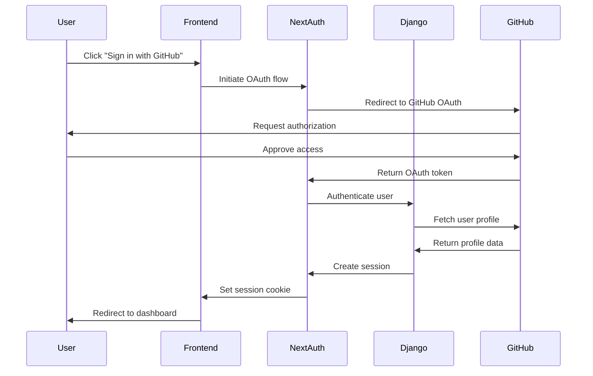

## Architecture Overview

OWASP Nest is a full-stack application built with modern web technologies and follows a containerized microservices architecture for both development and production environments.

<Frame>
  ```mermaid
  graph TB
      subgraph "Client Layer"
          Browser[Web Browser]
      end
      
      subgraph "Frontend Layer"
          NextJS[Next.js Application<br/>Port 3000]
      end
      
      subgraph "Backend Layer"
          Django[Django Backend<br/>Port 8000]
          Worker[Background Worker<br/>RQ Worker]
      end
      
      subgraph "Data Layer"
          PostgreSQL[(PostgreSQL + pgvector<br/>Port 5432)]
          Redis[(Redis Cache)]
      end
      
      subgraph "External Services"
          Algolia[Algolia Search]
          GitHub[GitHub API]
          Slack[Slack API]
          OpenAI[OpenAI API]
          Sentry[Sentry Error Tracking]
      end
      
      Browser --> NextJS
      NextJS -->|REST API| Django
      NextJS -->|GraphQL| Django
      Django --> PostgreSQL
      Django --> Redis
      Django --> Algolia
      Django --> GitHub
      Django --> Slack
      Django --> OpenAI
      Django --> Sentry
      NextJS --> Sentry
      Worker --> Redis
      Worker --> PostgreSQL
      Worker --> OpenAI
  ```
</Frame>

## Technology Stack

### Backend Stack

<CardGroup cols={2}>
  <Card title="Python 3.13" icon="python">
    Modern Python with latest language features and performance improvements
  </Card>
  <Card title="Django 6.0" icon="server">
    High-level Python web framework with batteries included
  </Card>
  <Card title="Django Ninja" icon="bolt">
    Fast, modern REST API framework built on top of Django
  </Card>
  <Card title="Strawberry GraphQL" icon="graphql" iconType="duotone">
    Code-first GraphQL library for Python with Django integration
  </Card>
  <Card title="PostgreSQL + pgvector" icon="database">
    Relational database with vector similarity search for AI features
  </Card>
  <Card title="Redis" icon="memory">
    In-memory cache and message broker for background jobs
  </Card>
  <Card title="Django RQ" icon="list-check">
    Redis Queue integration for asynchronous task processing
  </Card>
  <Card title="Gunicorn" icon="rocket">
    Production WSGI HTTP server
  </Card>
</CardGroup>

### Frontend Stack

<CardGroup cols={2}>
  <Card title="Next.js 16" icon="react">
    React framework with server-side rendering and app router
  </Card>
  <Card title="TypeScript" icon="code">
    Type-safe JavaScript for enhanced developer experience
  </Card>
  <Card title="React 19" icon="atom">
    Latest React with concurrent features and improved hooks
  </Card>
  <Card title="Tailwind CSS 4" icon="palette">
    Utility-first CSS framework for rapid UI development
  </Card>
  <Card title="HeroUI" icon="sidebar">
    React component library built on Tailwind CSS
  </Card>
  <Card title="Apollo Client" icon="download">
    GraphQL client with caching and state management
  </Card>
  <Card title="React Leaflet" icon="map">
    Interactive maps for OWASP chapter locations
  </Card>
  <Card title="ApexCharts" icon="chart-line">
    Modern charting library for data visualization
  </Card>
</CardGroup>

### External Services

<CardGroup cols={2}>
  <Card title="Algolia" icon="magnifying-glass">
    Fast, typo-tolerant search for projects, issues, and users
  </Card>
  <Card title="GitHub API" icon="github">
    Sync OWASP organization data, repositories, and issues
  </Card>
  <Card title="Slack" icon="slack">
    NestBot integration for community communication
  </Card>
  <Card title="OpenAI" icon="sparkles">
    AI-powered issue summaries and contribution suggestions
  </Card>
  <Card title="Sentry" icon="shield-exclamation">
    Real-time error tracking and performance monitoring
  </Card>
</CardGroup>

## Backend Architecture

### Django Apps Structure

The backend is organized into Django apps, each responsible for a specific domain:

```
backend/apps/
├── ai/              # AI agent, RAG, vector embeddings
├── api/             # REST and GraphQL API endpoints
├── common/          # Shared utilities and base classes
├── core/            # Core Django settings and WSGI
├── github/          # GitHub data models and sync logic
├── mentorship/      # Mentorship program features
├── nest/            # Nest-specific models and features
├── owasp/           # OWASP projects, chapters, committees
├── sitemap/         # Dynamic sitemap generation
└── slack/           # NestBot commands and event handlers
```

<Tabs>
  <Tab title="ai">
    **AI & Machine Learning**

    - LangChain agent for natural language queries
    - RAG (Retrieval-Augmented Generation) system
    - Vector embeddings with pgvector
    - OpenAI integration for summaries and suggestions
    - Document chunking and context extraction
  </Tab>
  
  <Tab title="api">
    **API Layer**

    - REST endpoints using Django Ninja
    - GraphQL schema with Strawberry
    - API versioning (v0)
    - CORS and CSRF protection
    - Request throttling and caching
  </Tab>
  
  <Tab title="github">
    **GitHub Integration**

    - Organization and repository models
    - Issue and pull request tracking
    - User profile syncing
    - Contribution aggregation
    - Rate limiting and webhook handling
  </Tab>
  
  <Tab title="owasp">
    **OWASP Data Models**

    - Projects with health metrics
    - Chapters with geographic data
    - Committees and governance
    - Events and conference management
    - Leader and member relationships
  </Tab>
  
  <Tab title="slack">
    **NestBot (Slack Bot)**

    - Slash commands for project search
    - Event handlers for mentions and DMs
    - Channel and user messaging
    - Interactive blocks and modals
    - Scheduled notifications
  </Tab>
  
  <Tab title="mentorship">
    **Mentorship Program**

    - Mentor and mentee profiles
    - Project mentorship assignments
    - Progress tracking
    - Communication tools
  </Tab>
</Tabs>

### Database Schema

The application uses PostgreSQL with the following key models:

<AccordionGroup>
  <Accordion title="GitHub Models">
    - `GitHubOrganization` - OWASP and related organizations
    - `GitHubRepository` - Project repositories
    - `GitHubIssue` - Contribution opportunities
    - `GitHubUser` - Contributor profiles
    - `GitHubPullRequest` - Code contributions
  </Accordion>
  
  <Accordion title="OWASP Models">
    - `Project` - OWASP projects with metadata
    - `Chapter` - Geographic chapters
    - `Committee` - OWASP committees
    - `Event` - Conferences and meetups
    - `Sponsor` - Corporate sponsors
  </Accordion>
  
  <Accordion title="AI Models">
    - `Embedding` - Vector embeddings for semantic search
    - `Context` - Document contexts for RAG
    - `Chunk` - Text chunks for AI processing
  </Accordion>
  
  <Accordion title="Mentorship Models">
    - `Mentor` - Mentor profiles
    - `Mentee` - Mentee profiles
    - `MentorshipAssignment` - Mentor-mentee relationships
  </Accordion>
</AccordionGroup>

### Configuration Classes

Django settings are organized using `django-configurations`:

```
backend/settings/
├── base.py         # Shared settings
├── local.py        # Local development (DEBUG=True)
├── test.py         # Test environment
├── e2e.py          # End-to-end tests
├── fuzz.py         # Fuzz testing
├── staging.py      # Staging environment
├── production.py   # Production environment
└── graphql.py      # GraphQL schema settings
```

Configuration is selected via the `DJANGO_CONFIGURATION` environment variable.

### API Design

<Tabs>
  <Tab title="REST API">
    **Django Ninja REST API**

    Base URL: `/api/v0/`

    Key endpoints:
    - `/api/v0/projects/` - Project listing and search
    - `/api/v0/chapters/` - Chapter information
    - `/api/v0/committees/` - Committee data
    - `/api/v0/issues/` - Contribution opportunities
    - `/api/v0/users/` - User profiles

    Features:
    - Automatic OpenAPI schema generation
    - Request/response validation with Pydantic
    - Built-in filtering and pagination
    - JWT authentication support
  </Tab>
  
  <Tab title="GraphQL API">
    **Strawberry GraphQL**

    Endpoint: `/graphql/`

    Key types:
    - `ProjectNode` - Project queries
    - `ChapterNode` - Chapter queries
    - `IssueNode` - Issue queries
    - `UserNode` - User queries

    Features:
    - Code-first schema definition
    - DataLoader for N+1 query optimization
    - Django ORM integration
    - Real-time subscriptions (planned)
    - GraphQL Playground for testing
  </Tab>
</Tabs>

## Frontend Architecture

### Next.js App Structure

```
frontend/src/
├── app/                    # Next.js 16 app router
│   ├── about/             # About pages
│   ├── api/               # API routes (auth, etc.)
│   ├── chapters/          # Chapter pages
│   ├── committees/        # Committee pages
│   ├── community/         # Community pages
│   ├── projects/          # Project pages and dashboard
│   └── layout.tsx         # Root layout
├── components/            # React components
│   ├── ui/               # Reusable UI components
│   ├── icons/            # Icon components
│   └── ...               # Feature components
├── hooks/                # Custom React hooks
├── server/               # Server-side utilities
├── types/                # TypeScript type definitions
├── utils/                # Client utilities
└── wrappers/             # Component wrappers
```

### Data Fetching Strategy

<Tabs>
  <Tab title="Server Components">
    **Next.js Server Components**

    Used for static/SSR pages:
    - Project listings
    - Chapter directories
    - Public profiles

    Benefits:
    - Zero client-side JavaScript
    - SEO-friendly
    - Fast initial page load
  </Tab>
  
  <Tab title="Client Components">
    **React Client Components**

    Used for interactive features:
    - Search interfaces
    - Dashboards
    - User settings
    - Real-time updates

    Data fetching:
    - Apollo Client for GraphQL
    - SWR for REST endpoints
    - React Query (planned migration)
  </Tab>
</Tabs>

### Authentication Flow



## Deployment Architecture

### Docker Compose Services

<Tabs>
  <Tab title="Local">
    **Local Development** (`docker-compose/local/compose.yaml`)

    Services:
    - `backend` - Django with hot reload
    - `frontend` - Next.js with Turbopack
    - `db` - PostgreSQL with pgvector
    - `cache` - Redis
    - `worker` - RQ worker with scheduler
    - `docs` - MkDocs documentation server

    Volumes:
    - Source code mounted for live editing
    - Database persisted in Docker volume
    - Poetry/pnpm dependencies cached
  </Tab>
  
  <Tab title="Production">
    **Production Deployment**

    Architecture:
    - AWS ECS with Fargate
    - Application Load Balancer
    - RDS PostgreSQL with Multi-AZ
    - ElastiCache Redis
    - S3 for static files
    - CloudFront CDN
    - Route 53 DNS

    Features:
    - Auto-scaling based on CPU/memory
    - Blue-green deployments
    - AWS X-Ray tracing
    - CloudWatch monitoring
  </Tab>
  
  <Tab title="Testing">
    **Test Environments**

    E2E Testing (`docker-compose/e2e/compose.yaml`):
    - Isolated database
    - Playwright browser automation
    - Fixtures loaded via `make load-data-e2e`

    Fuzz Testing (`docker-compose/fuzz/compose.yaml`):
    - Schemathesis for API fuzzing
    - Isolated backend instance
    - Property-based testing
  </Tab>
</Tabs>

### Build Process

<Steps>
  <Step title="Backend Build">
    ```dockerfile
    FROM python:3.13-slim
    RUN poetry install --without dev
    RUN python manage.py collectstatic
    ```
  </Step>
  
  <Step title="Frontend Build">
    ```dockerfile
    FROM node:24-alpine
    RUN pnpm install --frozen-lockfile
    RUN pnpm run build
    ```
  </Step>
  
  <Step title="Image Scanning">
    - Trivy for vulnerability scanning
    - Semgrep for security patterns
    - SBOM generation with CycloneDX
  </Step>
  
  <Step title="Deployment">
    - Push images to ECR
    - Update ECS task definitions
    - Run database migrations
    - Deploy to production
  </Step>
</Steps>

## Performance Optimizations

<CardGroup cols={2}>
  <Card title="Caching" icon="bolt">
    - Redis for session storage
    - Django cache framework
    - API response caching
    - CDN edge caching
  </Card>
  
  <Card title="Database" icon="database">
    - Connection pooling
    - Query optimization with select_related
    - Database indexes on foreign keys
    - pgvector for semantic search
  </Card>
  
  <Card title="Frontend" icon="gauge-high">
    - Next.js Image optimization
    - Code splitting and lazy loading
    - Bundle size monitoring
    - Tree shaking unused code
  </Card>
  
  <Card title="API" icon="network-wired">
    - GraphQL DataLoader for batching
    - Request throttling
    - Pagination on large datasets
    - Gzip compression
  </Card>
</CardGroup>

## Security Architecture

<AccordionGroup>
  <Accordion title="Authentication & Authorization">
    - OAuth 2.0 with GitHub
    - NextAuth.js session management
    - Django user permissions
    - Role-based access control (RBAC)
    - JWT tokens for API authentication
  </Accordion>
  
  <Accordion title="CSRF & CORS">
    - CSRF tokens for state-changing requests
    - CORS headers configured per environment
    - SameSite cookie attributes
    - Secure cookie flags in production
  </Accordion>
  
  <Accordion title="Secrets Management">
    - Environment variables for secrets
    - AWS Secrets Manager in production
    - GitHub encrypted secrets in CI/CD
    - No secrets in source code
  </Accordion>
  
  <Accordion title="Security Scanning">
    - Semgrep for SAST
    - Trivy for dependency vulnerabilities
    - ZAP for DAST
    - Snyk continuous monitoring
    - GitHub Advanced Security
  </Accordion>
</AccordionGroup>

## Monitoring & Observability

<CardGroup cols={2}>
  <Card title="Error Tracking" icon="bug">
    Sentry for both backend and frontend error monitoring with:
    - Real-time error alerts
    - Stack traces and breadcrumbs
    - Release tracking
    - Performance monitoring
  </Card>
  
  <Card title="Application Tracing" icon="route">
    AWS X-Ray for distributed tracing:
    - Request flow visualization
    - Latency analysis
    - Service map
    - Bottleneck identification
  </Card>
  
  <Card title="Logs" icon="file-lines">
    Centralized logging with:
    - CloudWatch Logs
    - Structured JSON logging
    - Log retention policies
    - Query and analysis tools
  </Card>
  
  <Card title="Metrics" icon="chart-simple">
    CloudWatch metrics for:
    - CPU and memory usage
    - Request rates and latency
    - Database connections
    - Cache hit rates
  </Card>
</CardGroup>

## Next Steps

<CardGroup cols={2}>
  <Card title="Backend Development" icon="python" href="/development/backend">
    Learn about Django backend development
  </Card>
  <Card title="Frontend Development" icon="react" href="/development/frontend">
    Learn about Next.js frontend development
  </Card>
</CardGroup>